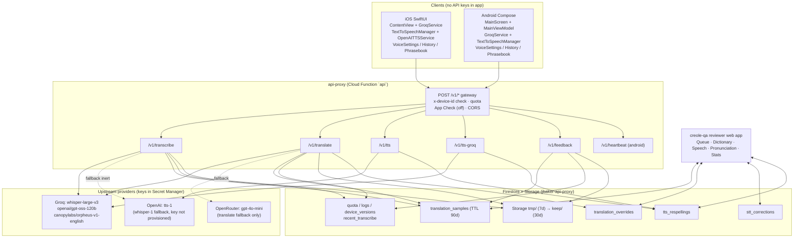
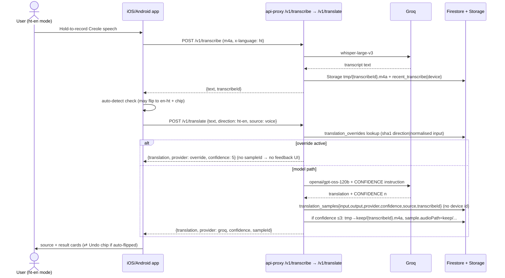
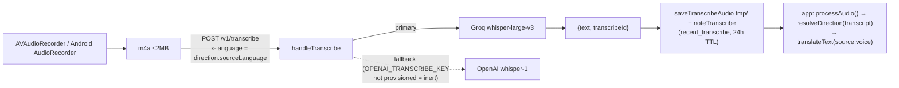
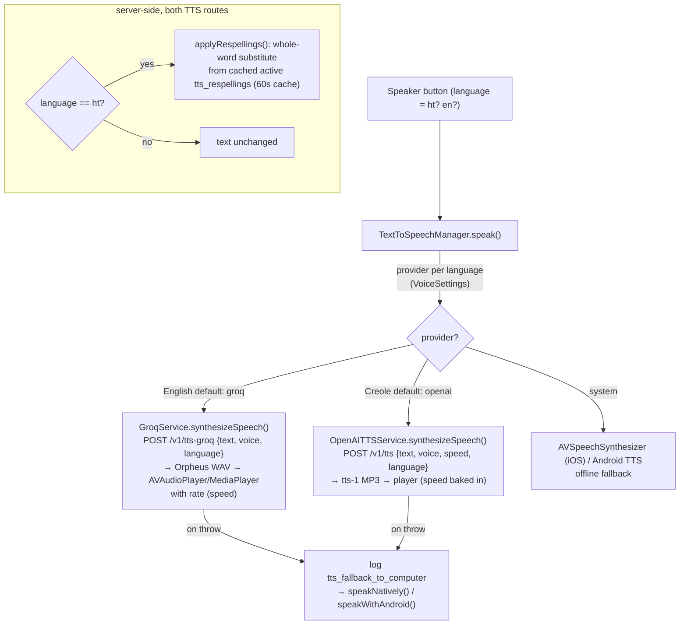

# CreoleTranslator — Program Specification

Haitian Creole ↔ English voice + text translator. Two native clients (iOS/SwiftUI, Android/Jetpack Compose) backed by a shared serverless backend (`api-proxy` Cloud Function) and a human review web app (`creole-qa`).

- iOS repo: `CreoleTranslator-iOS/` (this repo)
- Android repo: `/Users/jamesbaker/code/CreoleTranslator-android/` — see `FEATURE_PARITY.md` there for the per-feature file map
- Backend: `/Users/jamesbaker/code/api-proxy/functions/src/index.ts` (Firebase Functions v2, `us-central1`, route `api`)
- Review app: `/Users/jamesbaker/code/creole-qa/public/{index.html,app.js,style.css}`, rules in `/Users/jamesbaker/code/creole-qa/firestore.rules`, project `jbaker-api-proxy`

## 1. What the program does

1. **Voice translate**: record audio → Whisper speech-to-text → Llama translation → show source + result cards with per-card speaker buttons.
2. **Type translate**: typed text → translation (same backend, `source:"typed"`).
3. **Direction switcher**: Creole→English / English→Creole, plus offline auto-detect (`LanguageDetector`) that flips direction with an "Auto-detected · Undo" chip.
4. **TTS on demand**: speaker button per card, per-language provider/voice/speed settings.
5. **History**: last 50 translations on-device, favorites survive trimming.
6. **Phrasebook**: 52 offline phrases, 6 categories (Greetings/Basics/Directions/Emergency/Medical/Travel), reversible direction, speaker per phrase. No network.
7. **Feedback loop**: 👍/👎 on translation card and (voice only) on transcription card → feeds human review queue.
8. **Monetisation**: AdMob banner + interstitial (every 4 translations, max 6/session, ≥120s apart) + rewarded ad unlocking premium voices 24h. In-app review prompt at 3rd lifetime translation.

## 2. Architecture overview

### Key constants (keep in sync across all three repos)

| Constant | Value |
|---|---|
| Proxy base | `https://us-central1-jbaker-api-proxy.cloudfunctions.net/api` |
| Transcribe | `POST /v1/transcribe` — raw m4a body, `x-language: ht\|en` → `{text, provider, transcribeId}` |
| Translate | `POST /v1/translate` — `{text, direction:"ht-en"\|"en-ht", source:"voice"\|"typed"}` → `{translation, provider, confidence, sampleId}` |
| TTS (Creole default) | `POST /v1/tts` — `{text, voice, speed, language}` → MP3 (model `tts-1` pinned server-side) |
| TTS (English default) | `POST /v1/tts-groq` — `{text, voice, language}` → WAV (model `canopylabs/orpheus-v1-english`, 200-char truncate) |
| Feedback | `POST /v1/feedback` — `{sampleId, rating:"up"\|"down", comment?, target:"translation"\|"stt"}` |
| Whisper / LLM | `whisper-large-v3` / `openai/gpt-oss-120b` (temp 0.3, `CONFIDENCE: 1-5` trailer parsed by `parseTranslation()`) |
| Limits | TTS 500 chars, Groq-TTS 200, translate 1000, audio 2MB; per-device daily quotas + 5000 global/day |
| Auth | `x-device-id` header required (`ProxyDevice.id` / Android equivalent); App Check `ENFORCE_APP_CHECK=false` |

## 3. Flow diagrams

### 3.1 Creole → English (voice)

### 3.2 English → Creole (voice or typed)

Same as above with `direction: en-ht`, `x-language: en` for voice, `source:"typed"` for keyboard input. Typed path skips `/v1/transcribe` entirely (no transcript, no STT feedback button, `transcribeId=null`).

### 3.3 Speech-to-text flow + backends

- Old clients that omit `source` are inferred: `/translate` within 20s of the device's last `/transcribe` = voice, else typed (`inferSource()`); audio linkage window is 120s (`recentTranscribe()`).
- Audio retention: `tmp/` bucket lifecycle deletes after 7 days; promoted `keep/` clips (low-confidence ≤3 or 👎) after 30 days.

### 3.4 TTS flows + backends

Voices: OpenAI (Creole + English alt) `alloy, echo, fable, onyx, nova, shimmer`; Groq (English only) `autumn, diana, hannah, austin, daniel, troy`. Free: `diana` + `alloy`; rest unlock 24h via rewarded ad (`RewardedAdManager` + `VoiceSettings.premiumVoicesUnlockedUntil`). Speeds: `englishPlaybackSpeed` (default 1.0), `creolePlaybackSpeed` (default 0.7). Reviewers audition via QA Pronunciation page → `Listen` box (calls `/v1/tts` with `language:"ht"`, exactly what the app hears).

## 4. Local DB (on-device, no account)

| Store | iOS | Android | Contents |
|---|---|---|---|
| History | `TranslationHistory.swift` → `UserDefaults("translationHistory")`, JSON `[TranslationEntry]`, max 50 | `TranslationHistoryManager.kt` + `HistoryScreen.kt` | `{sourceText, translatedText, direction, timestamp, isFavorite}` — trim keeps all favorites, evicts oldest non-favorite tail; placeholder/empty entries never saved |
| Voice prefs | `VoiceSettings.swift` (`@AppStorage`) | `VoiceSettings.kt` (`SharedPreferences`) | `englishProvider/creoleProvider`, `englishGroqVoice`, `englishOpenAIVoice/creoleOpenAIVoice`, `englishPlaybackSpeed/creolePlaybackSpeed`, `autoDetectLanguage` (default ON), `premiumVoicesUnlockedUntil` |
| Device id | `ProxyDevice.id` (`UserDefaults proxyDeviceId`, UUID) | equivalent | sent as `x-device-id` on every proxy call; also the quota key |
| Phrasebook | `Phrasebook.swift` (static, in-binary) | `Phrasebook.kt` | 52 entries, never fetched, works offline |

No translation content is stored server-side against a device id — `captureSample()` deliberately omits it; `logs` holds only metadata.

## 5. Backend function (`api-proxy`, `functions/src/index.ts`)

Single Express-style `onRequest` handler `api` + two Firestore triggers + one reporting endpoint:

- `api` — routes `POST /v1/{tts, tts-groq, translate, transcribe, feedback, extract-restaurant, yelp, tmdb, heartbeat}`. Shared: CORS for `creole-qa` + `tvsharedlists` origins, `x-device-id` regex, App Check verify (non-enforcing), per-device + global daily quota transaction, metadata `logRequest()`.
- `handleTranslate` — override lookup → Groq `chatComplete` → OpenRouter fallback → `captureSample()` → conditional `keepAudio()`. Returns `provider` label inputs (`groq|override|openrouter-fallback`).
- `handleTranscribe` — Groq Whisper → (inert) OpenAI fallback; always `saveTranscribeAudio` + `noteTranscribe` on success.
- `handleTts / handleTtsGroq` — validate, `applyRespellings` when `language=="ht"`, upstream call, stream audio bytes back.
- `handleFeedback` — validates `sampleId` shape, writes `rating|comment` or `sttRating|sttComment` + timestamps; on `down` with a `transcribeId` and no `audioPath`, promotes the clip.
- `handleHeartbeat` — Android-only version adoption ping → `device_versions`.
- `usageSummary` (token-gated) — per-app device/request rollup for the nightly report + Android kill-switch adoption stats.
- `activateOverride` / `activateRespelling` triggers — flip `status→active` when **two distinct reviewers** approve the same `translation`/`respelling` text (see §6). 60s proxy respelling cache means a new pronunciation is heard within a minute.

Firestore collections used: `translation_samples`, `translation_overrides`, `stt_corrections`, `tts_respellings`, `reviewers`, `quota`, `logs`, `device_versions`, `recent_transcribe`.

## 6. Review system (adding / rejecting words, phrases, translations)

Web app: `https://creole-qa.web.app` → `public/app.js`. Google sign-in (redirect), membership from `reviewers` collection (`admin|reviewer`), bootstrap admin `jbaker00@gmail.com`; all rules in `firestore.rules`.

### 6.1 What gets into the queue

A sample lands in `translation_samples` on **every** model translation (input, output, `direction`, `provider`, `confidence 1-5|null`, `source voice|typed|unknown`, `transcribeId?`, `expireAt` +90d). It is **flagged** for review when:

- user tapped 👎 on the translation (`rating=="down"`, optional ≤500-char `comment`), or
- user tapped 👎 on the transcript for a voice result (`sttRating=="down"`, `sttComment?`, audio kept), or
- model `confidence ≤ 3` (low-confidence, audio auto-kept).

Queue tabs: Mine / Unassigned / All flagged / Reviewed; `Assign next to me` claims oldest unassigned transactionally; sort puts 👎 first, then lowest confidence.

### 6.2 Reviewer actions per sample (Queue page)

| Action | Writes | Effect |
|---|---|---|
| Assign to me | `samples.assignedTo/assignedAt` | ownership (only self or unassign allowed by rules) |
| Looks right | `reviewed:true, verdict:"correct", reviewedBy/At` | closes item, no dictionary change |
| Input is garbled — skip | `verdict:"garbled_input"` | closes item (voice inputs warn the transcript itself may be wrong) |
| Propose correction | create/update `translation_overrides/{sha1(direction\|normalised input)}` → `{direction,input,translation,status:"pending",proposedBy,approvals:[{by,translation}]}` + mark sample `corrected` | starts / joins / **replaces** the pending proposal (replacement restarts the approval count) |
| I agree — approve this | append `{by:me}` to pending override's `approvals` + mark sample `corrected` | 2nd distinct approval → trigger activates |
| Save correct transcription | create `stt_corrections/{sampleId}` `{whisperText,correctedText,direction,by}` + mark sample `garbled_input` w/ `correctedTranscript` | builds the STT corpus (immutable, one per sample) |
| Re-translate corrected text | live `POST /v1/translate {source:"typed"}` (reviewer device id) | preview only, shows provider + confidence |

### 6.3 Dictionary page (translation_overrides) — add / reject translations & phrases

- **Key** = `sha1(direction + "|" + lowercased/collapsed input)` — identical client input (case/spacing-insensitive) hits the entry; must match `overrideKey()` in proxy, QA app, and `translation_qa.py` exactly.
- **Pending → active**: requires **two distinct reviewers approving the same `translation` text**. Enforced twice: client rules only allow appending your own approval / replacing the candidate (which resets approvals to just yours); the `activateOverride` trigger flips `status:"active"` (+`activatedAt`). An `active` entry is served **before any model call** (`provider:"override"`, `confidence:5`, no `sampleId` → no feedback buttons) — so every correction also saves tokens permanently.
- **Rejecting**: `rejected` status is **admin-only** (`changedOnly(['status','activatedAt','note'])` + `allow delete: if admin()`); reviewers cannot reject, only propose/approve/replace. Admin can also force-`Activate` or `Deactivate`→pending from the Dictionary page.
- Same lifecycle covers single words, phrases, and full sentences — granularity is just the length of `input`.

### 6.4 Pronunciation page (tts_respellings) — add / reject Creole pronunciations

Same two-person state machine on `{word, respelling}` keyed by `sha1(lowercased word)`: reviewer proposes `word → respelling` (one word, no spaces), second reviewer approves identical respelling → `activateRespelling` trigger → `active`; applied whole-word, case-insensitive, Unicode-aware (`/[\p{L}\p{M}'’-]+/gu`) only when TTS request says `language:"ht"`; admin alone can Activate/Deactivate/Reject. `▶ hear respelling / original` buttons + `Listen` box audition through the real `/v1/tts` path.

### 6.5 Speech page (stt_corrections) — transcript corpus

Read-only list of human-verified `{WHISPER HEARD → ACTUALLY SAID}` pairs with audio playback (kept clips, 30d) + voice/clip/correction counters. Rules: create by reviewer (attributed, `correctedText`+`whisperText`+direction required), never updated, admin-deletable. Feeds future STT tuning; low-confidence/👎 voice samples without corrections remain listenable from the Queue.

### 6.6 Reviewers + Stats pages

Admin (`role:"admin"`) invites by Google email, toggles roles, removes (not self); membership checked live so changes take effect on next sign-in. Stats: captured/flagged/reviewed counts, 👎 vs STT-👎 vs low-confidence split, dictionary active/pending, voice share, per-reviewer correct/corrected/garbled/approvals table (30-day window).

## 7. Platform notes

- Feature checklist + file map: Android `FEATURE_PARITY.md` (source of truth; update it with every feature).
- Platform-only: Android has Firebase Remote Config kill switch (`AppAvailabilityManager`, `android_app_disabled`) + `heartbeat` adoption tracking; iOS has ATT consent (`ATTAuthorization` + `DataPrivacyConsent`) and Firebase Analytics TTS-fallback logging. Android `GROQ provider` TTS setting falls back to OpenAI proxy TTS.
- Privacy: samples store no device id; audio kept only for low-confidence/👎 voice inputs; samples expire 90d, `tmp/` audio 7d, `keep/` 30d; dictionary/corrections/respellings do not expire.
